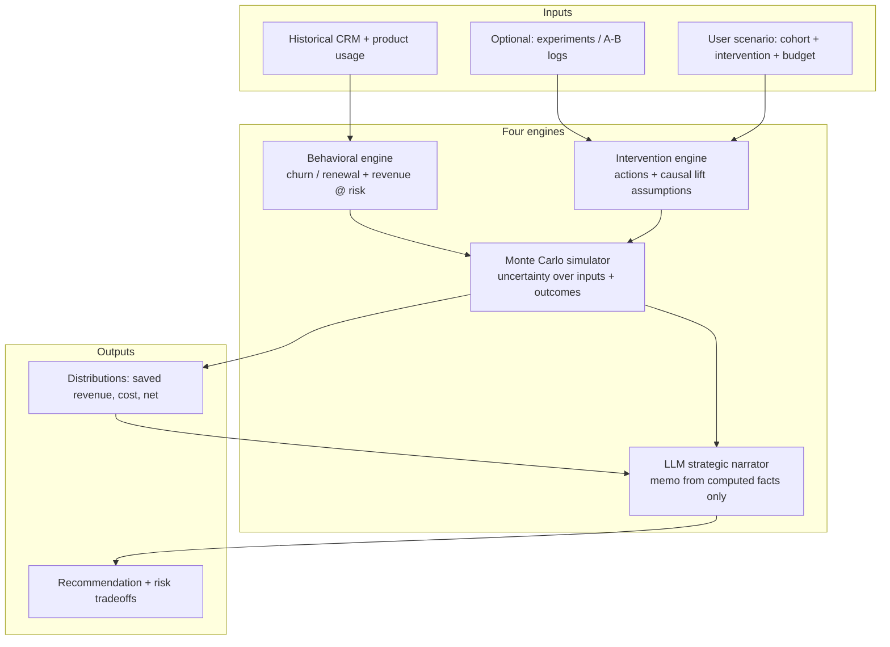
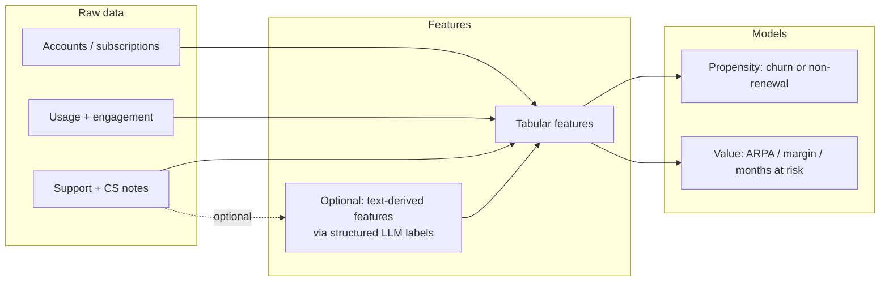
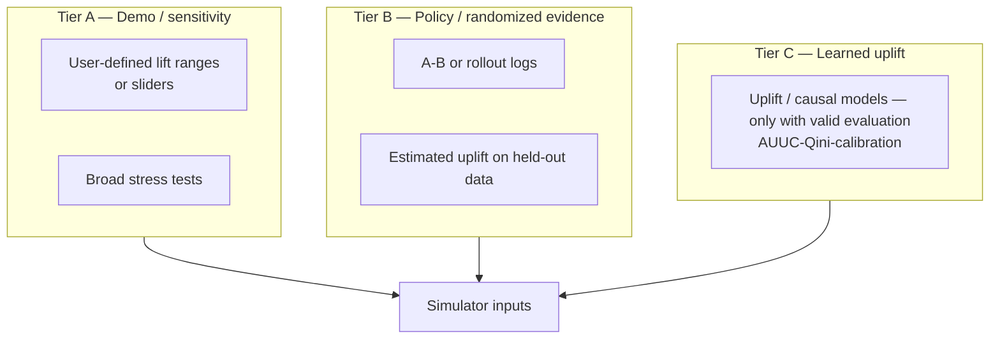
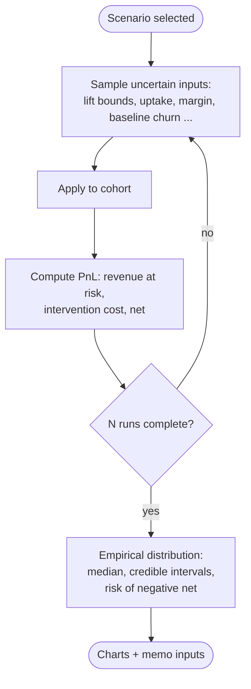
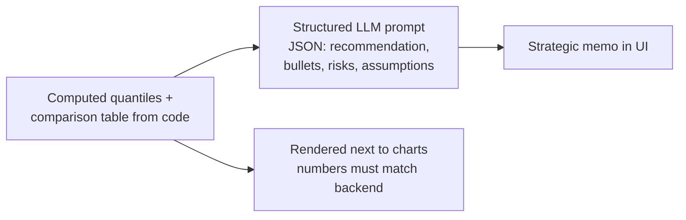
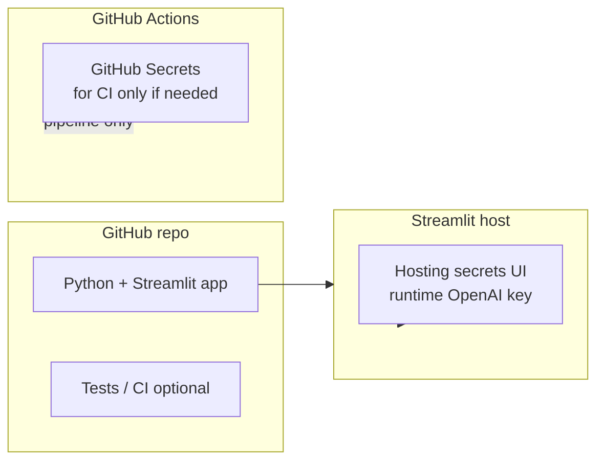

# Decision Intelligence Simulator — Project Flow

This document is the **logical blueprint** for what we build end-to-end: from data and models through interventions, uncertainty, and narrative. Diagrams use [Mermaid](https://mermaid.js.org/), which GitHub renders in markdown.

---

## 1. System overview (high level)

---

## 2. Data & model path (Behavioral engine)

---

## 3. Intervention & causal lift (transparent tiers)

We do **not** hide assumptions. Lift enters the simulator in explicit tiers:

---

## 4. Monte Carlo loop (uncertainty → distribution)

---

## 5. LLM narrator (guardrailed “so what?”)

**Rule:** The LLM summarizes and recommends from **frozen metrics** computed in Python—it does not invent percentiles or savings.

---

## 6. Build phases (recommended order)

| Phase | Focus |
| ------| ----- |
| **P0** | Synthetic or open dataset → Behavioral baseline → Streamlit cohort selector |
| **P1** | Intervention definitions + Tier A sensitivity + Monte Carlo + PnL rollup |
| **P2** | Optional Tier B evaluation slice + “validation” storyline |
| **P3** | Optional Tier C uplift + LLM narrator (Secrets on host, never in repo) |

---

## 7. Repository & deployment alignment (conceptual)

Use **GitHub Secrets** for automation (tests, deploy jobs). Use the **host’s secret manager** for the live app’s OpenAI key.
